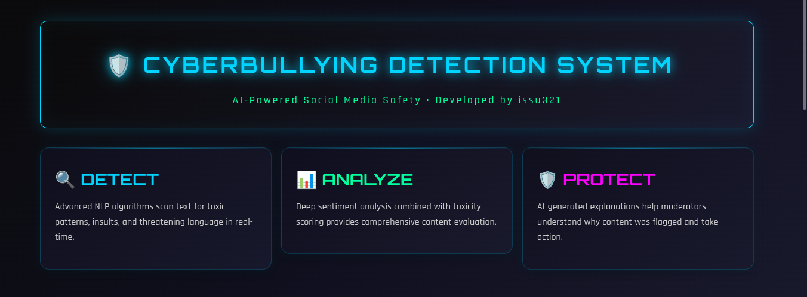
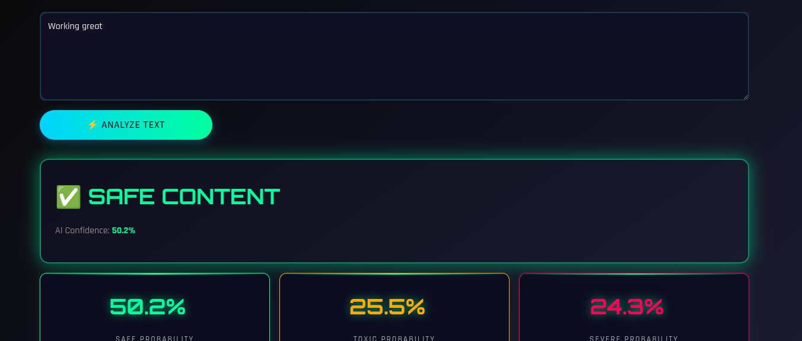
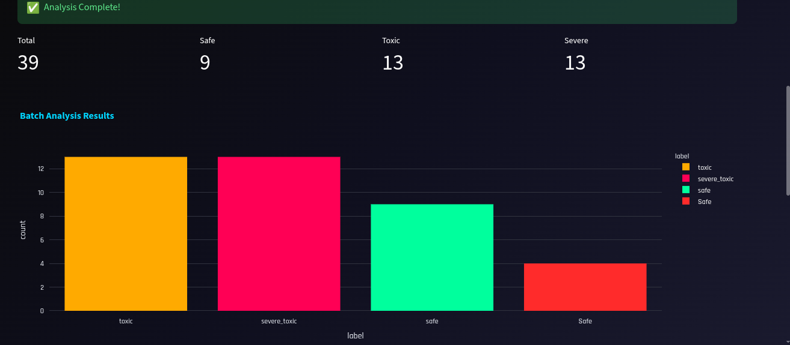

# 🛡️ Cyberbullying Detection on Social Media

<div align="center">

```
╔═══════════════════════════════════════════════════════════════╗
║     CYBERSHIELD AI - NEXT-GEN SOCIAL MEDIA PROTECTION       ║
║              Developed by issu321                             ║
╚═══════════════════════════════════════════════════════════════╝
```

[](https://python.org)
[](https://streamlit.io)
[](https://scikit-learn.org)
[](https://nltk.org)
[](https://plotly.com)

**AI-Powered Cyberbullying Detection System for Safer Social Media**

[🚀 Quick Start](#-installation) • [📖 Documentation](#-usage-guide) • [🤝 Contribute](#-contributing)

</div>

---

## 🌟 Overview

**CyberShield AI** is a cutting-edge, lightweight cyberbullying detection platform built with Python NLP. It combines traditional machine learning (TF-IDF + Logistic Regression) with modern sentiment analysis to identify, classify, and explain toxic content in real-time.

> *"Protecting digital spaces through intelligent text analysis."*
> — **issu321**

---

## ✨ Features

### 🔍 Real-Time Detection
- Instant toxicity classification: **Safe**, **Mild Toxic**, **Severe Toxic**
- Confidence scoring with visual gauge charts
- AI-generated human-readable explanations

### 😊 Sentiment Analysis
- VADER-based sentiment scoring
- Positive / Neutral / Negative classification
- Compound score visualization

### 📁 Batch Processing
- Upload CSV files for bulk analysis
- Automatic column detection
- Downloadable results with full probability breakdown

### 📊 Interactive Dashboard
- Plotly-powered visualizations
- Dataset distribution analytics
- Session history tracking
- Toxicity trend monitoring

### 🎨 Cyberpunk UI
- Dark futuristic theme
- Neon blue & green accents
- Responsive Streamlit interface
- Animated metric cards

---

## 🚀 Installation

### Linux / macOS
```bash
chmod +x install.sh
./install.sh
```

### Windows
```batch
install.bat
```

### Manual Installation
```bash
# Clone the repository
git clone https://github.com/issu321/Cyberbullying-Detection-on-Social-Media.git
cd Cyberbullying-Detection-on-Social-Media

# Create virtual environment
python -m venv venv

# Activate (Linux/macOS)
source venv/bin/activate

# Activate (Windows)
venv\Scripts\activate

# Install dependencies
pip install -r requirements.txt

# Download NLTK data
python -c "import nltk; nltk.download('vader_lexicon', quiet=True); nltk.download('stopwords', quiet=True); nltk.download('punkt', quiet=True)"

# Launch application
python -m streamlit run app.py
```

---

## 📖 Usage Guide

### Real-Time Analysis
1. Navigate to **🔍 Real-Time Detection**
2. Enter text in the input box
3. Click **⚡ ANALYZE TEXT**
4. View toxicity classification, confidence gauge, and AI explanation

### Batch Analysis
1. Go to **📁 Batch Analysis**
2. Upload a CSV file with a `comment` or `text` column
3. Click **🚀 RUN BATCH ANALYSIS**
4. Download results as CSV

### Analytics
- Visit **📊 Analytics Dashboard** to see dataset statistics and session history

---

## 📸 Screenshots

| Home Dashboard | Real-Time Detection | Batch Analysis |
|:---:|:---:|:---:|
|  |  |  |

---

## 🛠️ Technologies Used

| Category | Technology |
|----------|------------|
| **Language** | Python 3.11+ |
| **Frontend** | Streamlit |
| **NLP** | NLTK, scikit-learn |
| **ML Model** | TF-IDF + Logistic Regression |
| **Visualization** | Plotly |
| **Data** | pandas, numpy |

---

## 📁 Folder Structure

```
Cyberbullying-Detection-on-Social-Media/
│
├── app.py                 # Main application (backend + frontend)
├── requirements.txt       # Python dependencies
├── README.md              # Project documentation
├── install.sh             # Linux/macOS installer
├── install.bat            # Windows installer
├── inputguide.md          # Detailed usage guide
├── dataset.csv            # Educational sample dataset
├── .gitignore             # Git ignore rules
└── assets/
    └── styles.css         # Cyberpunk theme styling
```

---

## 🎯 Example Predictions

| Input Text | Prediction | Confidence | Sentiment |
|------------|------------|------------|-----------|
| "Great job team!" | ✅ Safe | 98.5% | 😊 Positive |
| "You are so stupid" | ⚠️ Toxic | 94.2% | 😠 Negative |
| "You should just disappear forever" | 🚨 Severe Toxic | 97.8% | 😠 Negative |

---

## 🔮 Future Improvements

- [ ] Integration with Hugging Face Transformers (BERT/RoBERTa)
- [ ] Multi-language toxicity detection
- [ ] REST API endpoint for third-party integration
- [ ] Real-time social media stream monitoring
- [ ] Advanced explainability with LIME/SHAP
- [ ] User moderation workflow integration

---

## 🤝 Contributing

Contributions are welcome! Please follow these steps:

1. Fork the repository
2. Create a feature branch (`git checkout -b feature/amazing-feature`)
3. Commit your changes (`git commit -m 'Add amazing feature'`)
4. Push to the branch (`git push origin feature/amazing-feature`)
5. Open a Pull Request

**Developer:** [issu321](https://github.com/issu321)

---

## 📄 License

This project is licensed under the MIT License - see the [LICENSE](LICENSE) file for details.

---

<div align="center">

**🛡️ CYBERSHIELD AI**

*Developed by [issu321](https://github.com/issu321)*

⭐ Star this repo if you find it useful!

</div>
